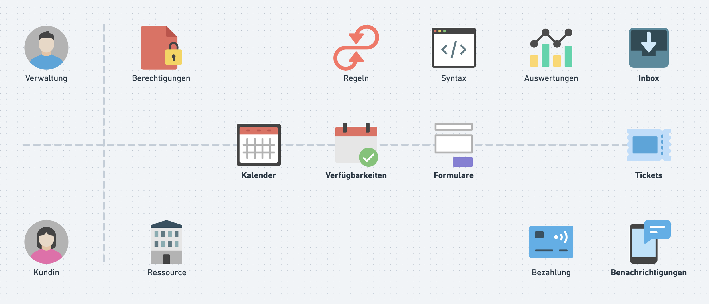

# Reservationen

## Ressourcen zur Reservation
Die Plattform bietet ein bewährtes Online-Reservationssystem für die einfache und zuverlässige Verwaltung von Ressourcen. Dazu zählen zum Beispiel Mehrzweckhallen, Gemeindesäle oder weitere öffentliche Einrichtungen, die zentral erfasst und verwaltet werden.

## Übergeordnete Ressourcen (Abhängigkeiten)
Reservationen auf einer übergeordneten Ressource blockieren den reservierten Zeitraum auch für die untergeordnete Ressource und umgekehrt. In der Belegungsansicht werden Reservationen von über- und untergeordneten Ressourcen ebenfalls angezeigt.

## Verfügbarkeiten

Administratorinnen und Administratoren definieren im Backend die verfügbaren Ressourcen, deren Kapazitäten sowie die buchbaren Zeitblöcke. So lassen sich Verfügbarkeiten klar steuern und Reservationen transparent organisieren.

## Formulare und Online-Bezahlung
Für jede Ressource können zudem spezifische [Formularfelder](/module/formulare/) hinterlegt werden, damit bei einer Buchung genau die benötigten Informationen erfasst werden. Bei Bedarf kann zusätzlich ein direkter [Bezahlprozess](/module/online-bezahlung/)  aktiviert werden, wodurch der gesamte Ablauf von der Reservation bis zur Zahlung digital und medienbruchfrei erfolgt.

Die Grafik zeigt die Hauptkomponeten eines Termin- oder Reservationssystems, aufgeteilt in Verwaltungs- und Kundenbereich.

## Verwaltungsbereich (Admin)

### Verwaltung

Im Bereich Verwaltung werden Benutzerkonten zentral gepflegt und den zuständigen Stellen zugeordnet. Dadurch lassen sich Zuständigkeiten klar regeln und Zugriffe bei personellen Änderungen schnell anpassen.

### Berechtigungen

Berechtigungen steuern, welche Rollen welche Funktionen im System nutzen dürfen (z. B. Administration, Support oder Leserechte). So wird sichergestellt, dass sensible Daten und Prozesse nur von autorisierten Personen bearbeitet werden.

### Regeln

Unter Regeln werden zentrale Buchungslogiken wie Fristen, Kontingente und automatische Einschränkungen definiert. Diese Vorgaben sorgen für einen einheitlichen Ablauf und reduzieren manuelle Korrekturen im Tagesbetrieb.

### Formulare (Syntax)

Im Bereich Formulare (Syntax) werden Felder, Pflichtangaben und Formularstrukturen für Reservationen konfiguriert. Dadurch können je nach Ressource genau die Informationen erfasst werden, die für Prüfung und Abwicklung notwendig sind.

### Auswertungen

Auswertungen liefern Kennzahlen zu Buchungen, Auslastung und Nutzung über frei definierbare Zeiträume. Die Ergebnisse unterstützen die Planung von Kapazitäten und die Weiterentwicklung des Angebots.

### Inbox

Die Inbox bündelt neue Buchungen, Rückfragen und systemseitige Hinweise an einem Ort. Offene Aufgaben können dadurch schneller priorisiert und ohne Medienbrüche bearbeitet werden.

## Planungs- und Organisationsmodule

### Kalender

Der Kalender zeigt alle Reservationen in einer klaren Zeitansicht auf Tages-, Wochen- oder Monatsbasis. Konflikte, freie Zeitfenster und anstehende Belegungen sind damit auf einen Blick erkennbar.

### Verfügbarkeiten

Bei den Verfügbarkeiten werden Buchungsfenster, Öffnungszeiten und Sperrzeiten je Ressource festgelegt. So wird verhindert, dass ausserhalb definierter Zeiten oder bei Blockierungen reserviert werden kann.

### Formulare

Mit Formularen werden Buchungs- und Kontaktprozesse strukturiert abgebildet und an den jeweiligen Anwendungsfall angepasst. Zusätzliche Felder ermöglichen die gezielte Erfassung von Angaben wie Anlass, Teilnehmerzahl oder Infrastrukturbedarf.

### Tickets

Tickets führen einzelne Reservationen mit allen relevanten Angaben und dem aktuellen Bearbeitungsstatus. Änderungen und Entscheide bleiben nachvollziehbar, wodurch die Kommunikation mit den Beteiligten erleichtert wird.

## Kundenbereich

### Kundenprofil

Im Kundenprofil verwalten Nutzerinnen und Nutzer ihre persönlichen Angaben sowie relevante Kontaktdaten. Zusätzlich sind vergangene und aktuelle Reservationen einsehbar, was die Selbstverwaltung und Nachvollziehbarkeit verbessert.

### Ressource

Eine Ressource ist die buchbare Einheit im System (z. B. Raum, Gerät oder Dienstleistung). Für jede Ressource lassen sich Verfügbarkeiten, Buchungsregeln und bei Bedarf zusätzliche Angaben im Reservierungsformular definieren.

### Bezahlung

Im Bereich Bezahlung werden digitale Zahlungen abgewickelt und mit passenden Zahlungsanbietern verbunden. Rechnungen, Zahlungsstatus und offene Beträge können zentral überwacht und administrativ nachbearbeitet werden.

### Benachrichtigungen

Benachrichtigungen informieren automatisiert über Buchungsbestätigungen, Änderungen und Erinnerungen. Der Versandkanal kann je nach Prozess über E-Mail oder SMS-Mitteilung erfolgen.

## Weiterführende Anleitung

- [Reservationen erstellen](/module/reservationen/erstellen/)
