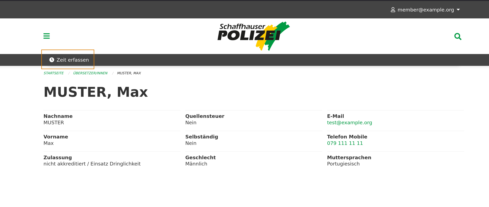
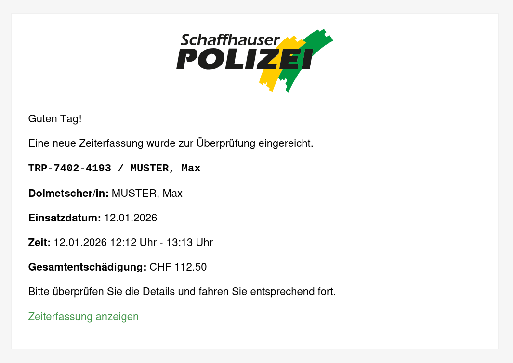
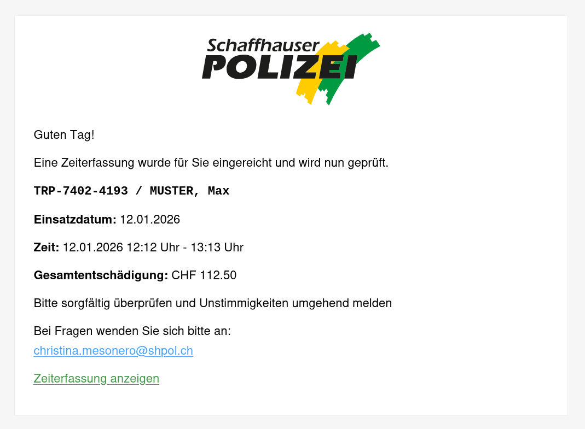
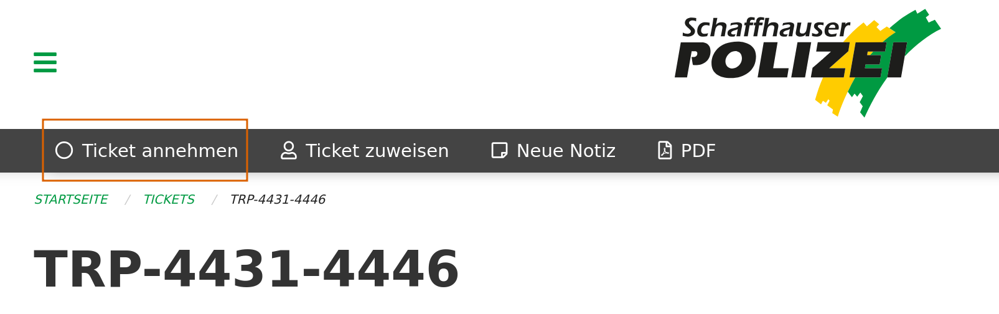
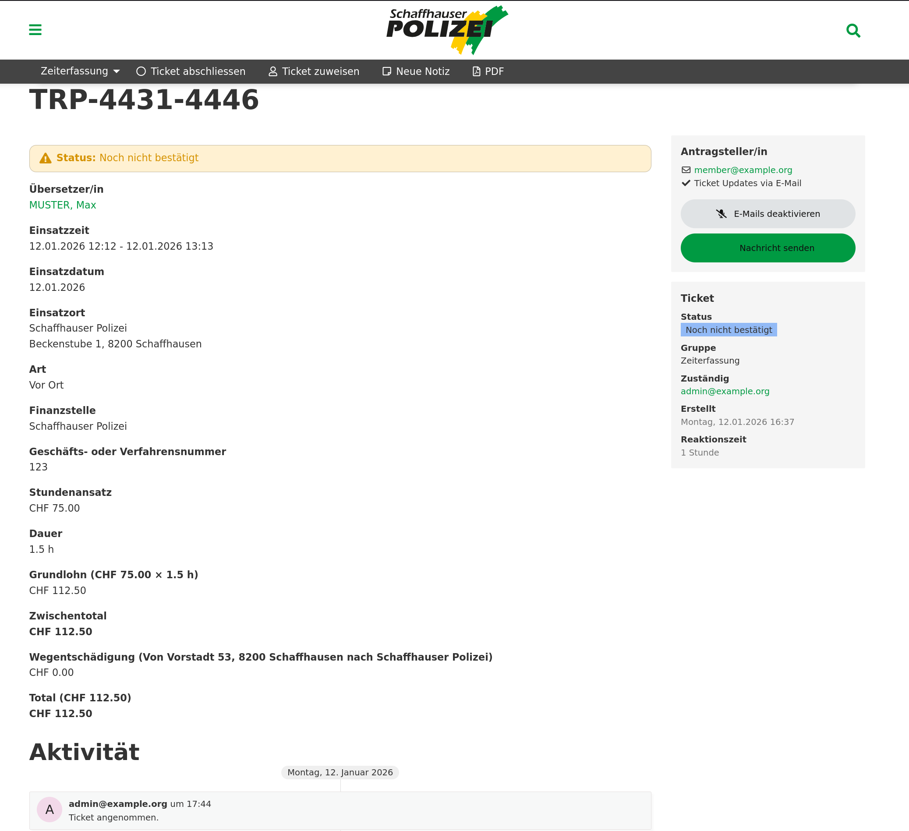
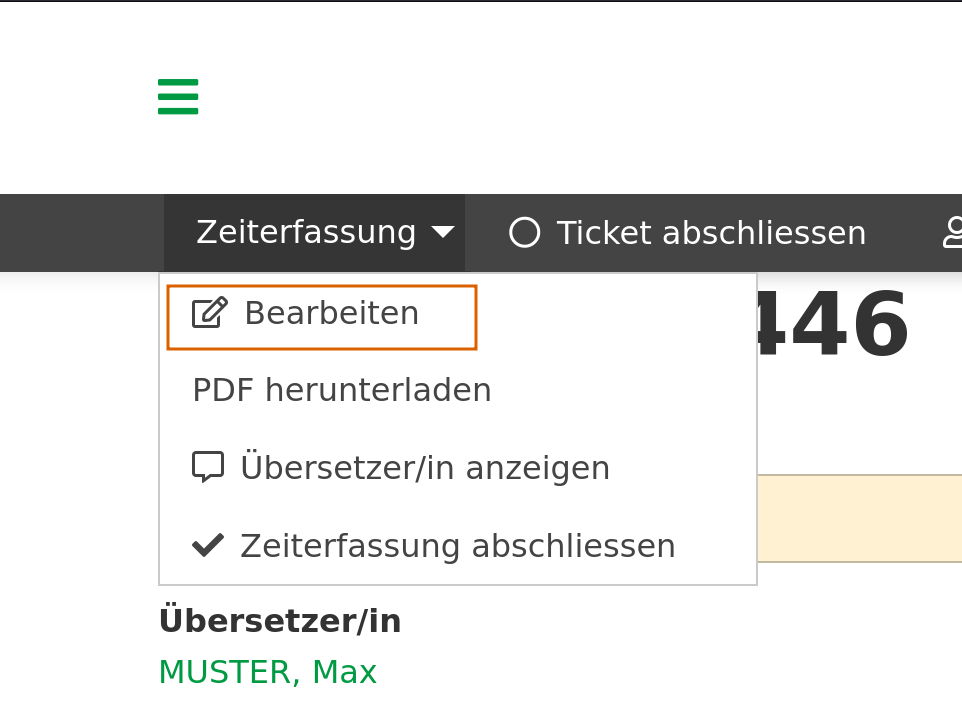
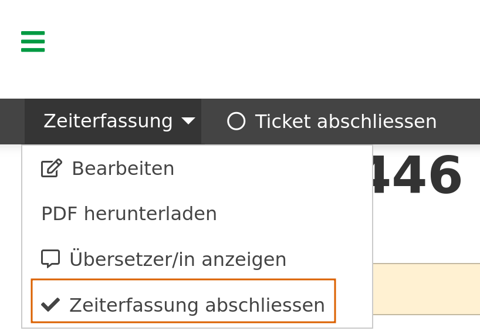
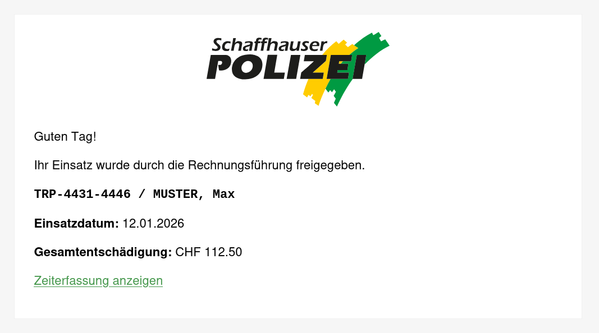
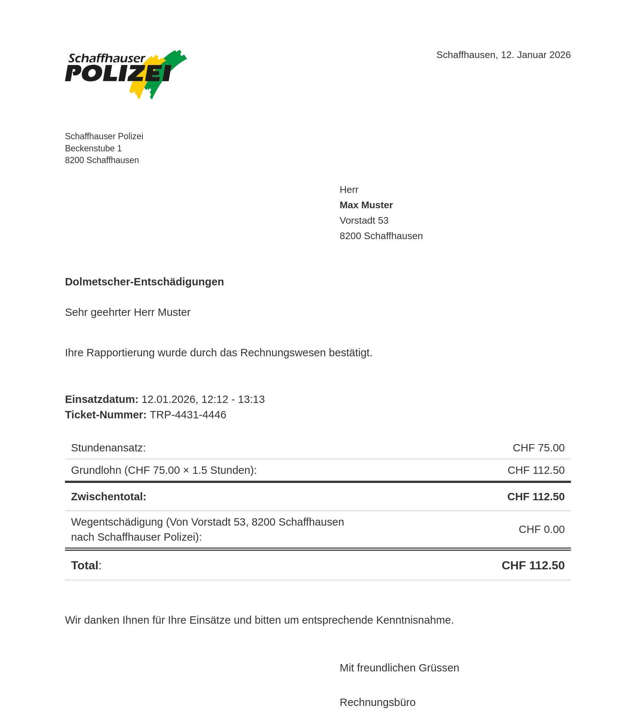
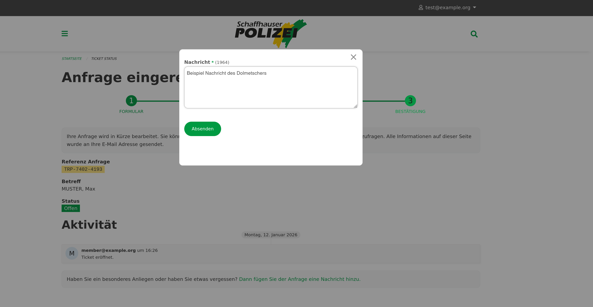

# Zeiterfassung Übersetzerverzeichnis

## Zeit erfassen

1. Suchen Sie die gewünschte Person im System.

2. Auf der Detailansicht der Person angelangt, klicken Sie auf die Option "Zeit erfassen".

3. Füllen Sie das Formular aus. Pflichtfelder sind mit "*" gekennzeichnet.

    - **Art der Dolmetschung**: Muss nur angepasst werden, falls "vor Ort" nicht zutrifft.
    - **Einsatzort**: Ort, an dem die Dolmetschung stattgefunden hat. Falls Art der Dolmetschung telefonisch ist, wird der Einsatzort ausgeblendet.
    - **Finanzstelle**: Zuständige Dienststelle für die Abrechnung.
    - **Start- und Endzeit sowie Datum**: Pflichtfeld. Es wird automatisch auf die nächste halbe Stunde gerundet.
    - **Pausenzeit**: Kann leergelassen werden. Pausen werden von der Zeit abgezogen.
    - **Geschäfts- oder Verfahrensnummer**: Zur Verknüpfung. Pflichtfeld.

4. Vergewissern Sie sich, dass alle Eingaben stimmen. Klicken Sie auf "Zeiterfassung einreichen". Dadurch wird ein E-Mail an Dolmetscher und Rechnungsführer/in verschickt (siehe nachfolgende Abbildungen).

5. Die Zeit ist nun erfasst und ein entsprechendes Ticket erstellt worden. Die Rechnungsführer/in kann in einem weiteren Schritt die Zeiterfassung überprüfen. Die Wegberechnung erfolgt automatisch basierend auf der Distanz zwischen der Adresse der dolmetschenden Person und dem Einsatzort.

## Zeiterfassung überprüfen und abschliessen (Rechnungsführer/in)

Nachdem die Zeiterfassung eingereicht wurde, erhält die Rechnungsführer/in ein E-Mail mit einem Link zum entsprechenden Ticket. Die Person, die die Zeiterfassung erstellt hat, kann keine Änderungen mehr vornehmen. Nur die Rechnungsführer/in kann die Zeiterfassung bearbeiten und abschliessen.

1. Klicken Sie auf den Link im E-Mail, um zum Ticket zu gelangen.

2. Klicken Sie auf "Ticket annehmen", um die Bearbeitung zu starten.

    

3. Sie sehen nun die Ticket-Übersicht mit allen Details der Zeiterfassung.

    

4. Falls Änderungen nötig sind, klicken Sie auf "Zeiterfassung bearbeiten" in der Bearbeitungsleiste.

    

5. Wenn alle Angaben korrekt sind, wählen Sie "Zeiterfassung abschliessen" aus dem Dropdown-Menü in der Bearbeitungsleiste.

    

!!! warning "Wichtig"
    Nach dem Abschliessen können keine Änderungen mehr vorgenommen werden!

6. Nach dem Abschliessen wird automatisch ein E-Mail an die dolmetschende Person gesendet, welches den Betrag in CHF bestätigt. Zusammen mit dem E-Mail wird auch ein PDF mit den vollständigen Abrechnungsdetails versendet.

    

    

## Kommunikation mit Dolmetschenden

Dolmetschende können über das System Nachrichten senden. Über den Link im E-Mail "Zeiterfassung anzeigen" gelangen Sie auf diese Ansicht und können die Nachricht im System beantworten. Diese werden dann auf dem Ticket angezeigt.

